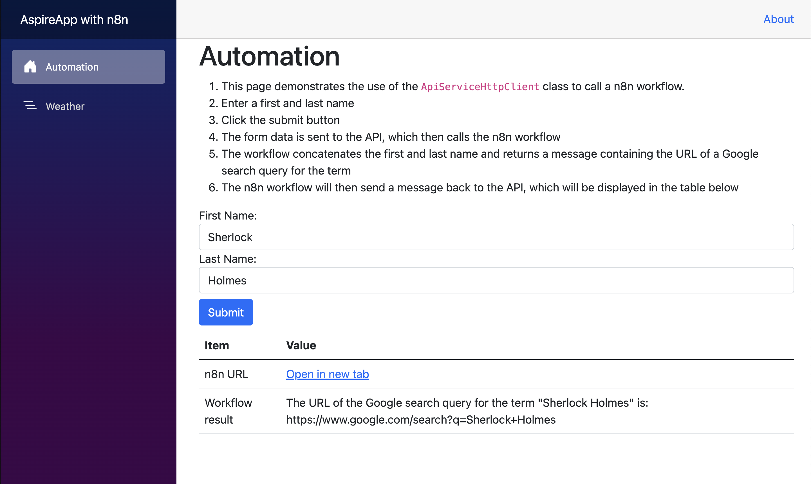
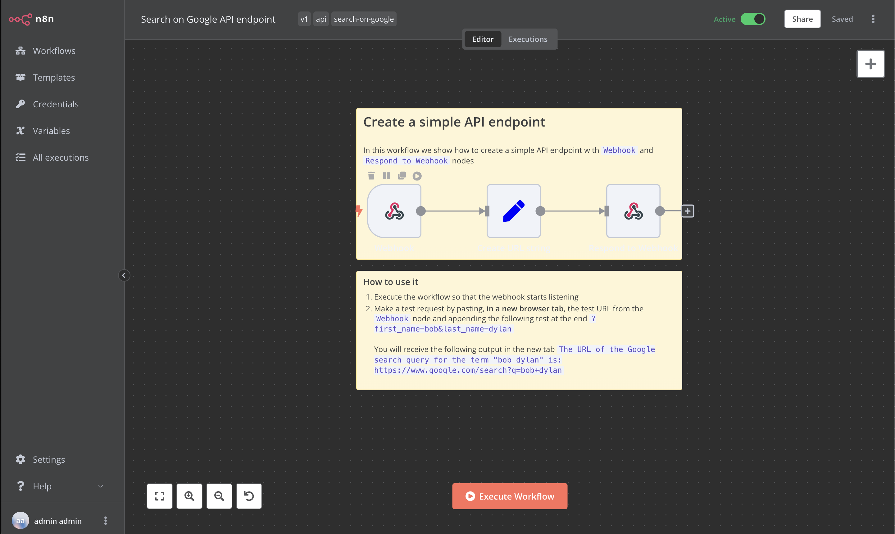

# .NET 8 Aspire App with n8n Automation 🚀

---

## Introduction 📖

Welcome to the demo application showcasing the integration of the .NET 8 Aspire App with n8n, a powerful workflow automation tool. This project aims to demonstrate the ease of using n8n to create efficient and automated workflows within a .NET 8 environment, offering an alternative to solutions like Microsoft Power Automate.

The .NET 8 Aspire App represents the latest in .NET technology, designed for building high-performance, modern applications. Coupled with n8n's extendable architecture, this demo serves as an ideal starting point for developers looking to explore advanced automation in their apps.

*Blazor Automation Interface*

*n8n Workflow Example*

## Note to Developers 👨‍💻
This application is a demonstration and not intended for production use. It serves as a foundation for you to build and customize your applications using n8n and .NET 8 Aspire App.

## Getting Started 🚦

### Prerequisites 📋
Before you begin, ensure you have the following installed:
- [Docker](https://docs.docker.com/get-docker/) - For containerization of the n8n workflow.
- [.NET 8 SDK](https://dotnet.microsoft.com/download/dotnet/8.0) - The software development kit for .NET 8 applications.
- .NET Aspire Workload - Essential for running the Aspire App.

### Installation and Configuration 🛠️
1. **Clone the Repository**: Start by cloning the repository to your local machine.
2. **Open the Solution**: Navigate to the cloned directory and open the solution file in your preferred IDE.
3. **Launch the AspireAppWithAutomation.AppHost Project**: Find and launch the `AspireAppWithAutomation.AppHost` project to get the app up and running.

## n8n Setup 🌐
To configure the n8n container, use the following default settings:

| Key        | Value              |
|------------|--------------------|
| email      | **admin@demo.com** |
| first name | **admin**          |
| last name  | **admin**          |
| password   | **Passw0rd**       |

*Note: These settings can be modified based on your requirements. A SQLite database stores the n8n data, located in the `n8n-data` folder.*

## Contributing 🤝
We welcome contributions! If you would like to contribute, please feel free to submit a pull request or open an issue for discussion.

## Support and Contact 📬
For support or inquiries about this project, please open an issue in the GitHub repository or contact [Your Contact Information].

## License 📜
This project is licensed under the MIT License - see the [LICENSE](LICENSE) file for details.
